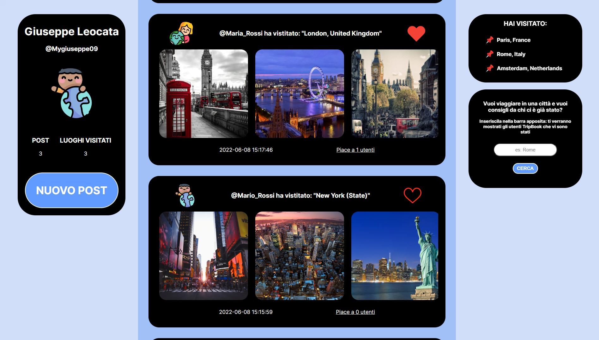
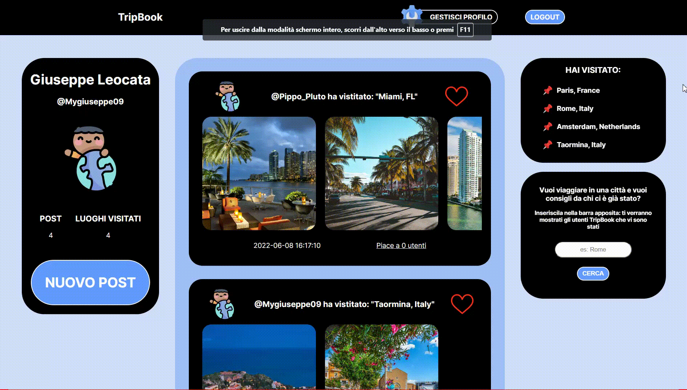

# About TripBook

Tripbook is a social network web app where users can, after registering, 
publish 'posts' communicating to all tripbookers where they have been.
There is a dashboard that lists all the places visited.

### Characteristics:

- client and server validations for signup and login
- ability to like a post
- possibility to delete your own post
- possibility of inserting a name of any city 
and obtaining as output all the users who have been there,
  with the possibility of obtaining the email in order to ask for information about the place

# _Screenshots_:

### INDEX

### SIGNUP

## SIGNUP CLIENT VALIDATIONS

### LOGIN

### SIGNUP SERVER VALIDATION

### HOME

### LIKES

### DASHBOARD

# _VIDEO DEMO_:

### PUT AND REMOVE LIKE

### CREATING A NEW POST

### DELETE A POST

### SEARCH USERS BY NAME'S CITY

# DATABASES: 

## - MySQL

### DATABASE'S STRUCTURE (DIAGRAM)

### [LINK to SQL](db_structure.sql)

## - MongoDB
### DATABASE'S STRUCTURE 

### [LINK to JSON (to import) ](images.json)

